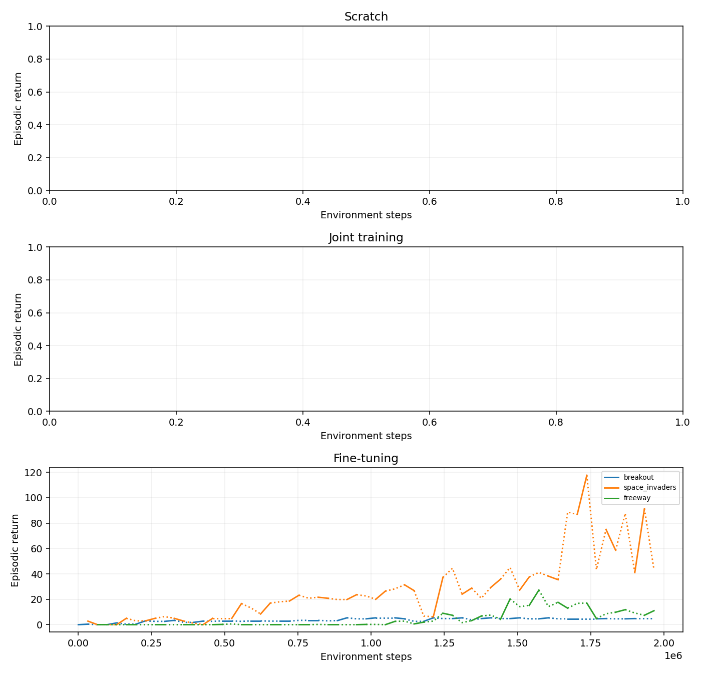
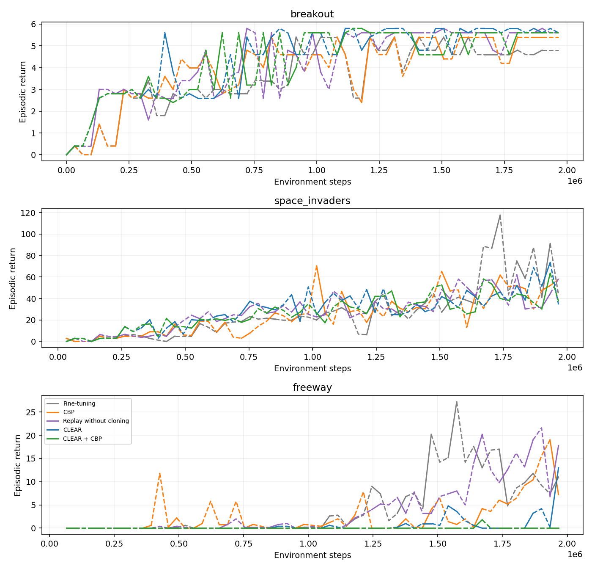
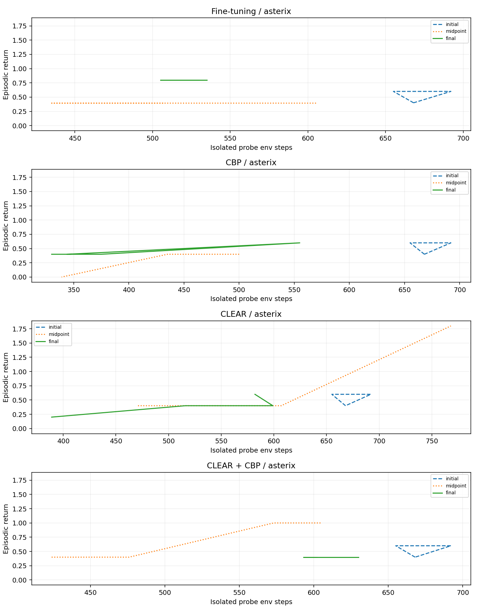
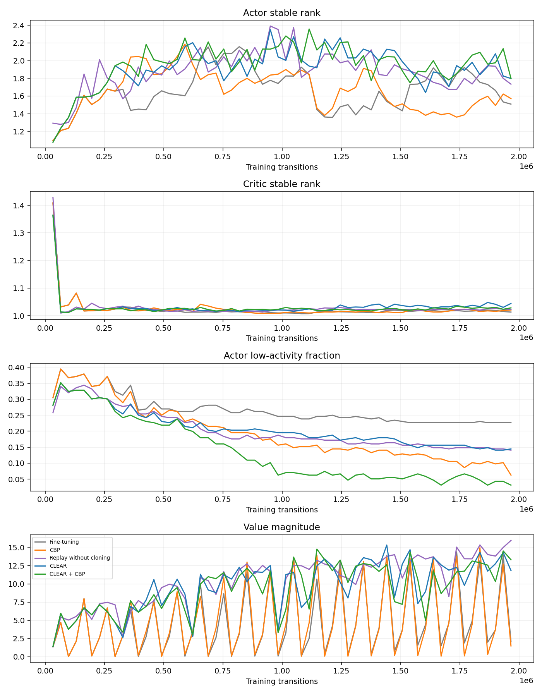

# CLEAR and continual backpropagation

**Inconclusive demonstration.** Suite: **minatar**. One seed (0), 60 matched completed blocks. No confidence intervals or statistical ranking.

The pipeline took **20.8 minutes** on NVIDIA GeForce RTX 3090, with 4 concurrent runs selected by profiling. Each compared arm received 1,966,080 main-training transitions, within a configured maximum of 60 minutes.

CartPole did not qualify (learning **False**, forgetting **True**, plasticity loss **False**), so the fallback selected MinAtar.

The raw probe-AUC threshold was crossed, but the fresh reference did not learn enough above random. That threshold alone is not evidence of plasticity loss.

## Benchmark qualification

- All pilots completed: **True**.
- Scratch and joint learnability gate: **False**.
- Forgetting gate: **False**.
- Fresh-task plasticity-loss gate: **False**.

CartPole uses observable sensor permutations and actuator direction with standard physics. Its gate requires scratch and joint returns of 400 on every task, retention drops of 100 on two tasks, and late isolated-probe AUC deficits of 0.10 on two held-out tasks. A failed CartPole gate triggers MinAtar in auto mode.

MinAtar requires scratch minus random to exceed max(1, 0.2 × random), and joint return to retain at least 80% of that improvement on every recurring game. Forgetting must reach 20% of the scratch improvement on two games. The Asterix probe must show a 10% normalized AUC deficit, with a scratch probe that passes the same above-random learning check. These are operational demonstration thresholds, not significance tests.

| Pilot task | Random | Scratch | Joint |
|---|---:|---:|---:|
| breakout | 0.2 | 0.4 | 0.4 |
| space_invaders | 3.6 | 2.8 | 6.0 |
| freeway | 0.8 | 13.4 | 0.0 |

## Matched final returns

| Arm | breakout | space_invaders | freeway | Normalized AP |
|---|---:|---:|---:|---:|
| Fine-tuning | 4.8 | 43.2 | 11.0 | unavailable |
| CBP | 5.4 | 57.8 | 7.2 | unavailable |
| Replay without cloning | 5.6 | 58.4 | 17.8 | unavailable |
| CLEAR | 5.6 | 34.4 | 13.0 | unavailable |
| CLEAR + CBP | 5.6 | 37.4 | 0.0 | unavailable |

One panel per baseline arm (scratch, joint training, fine-tuning; whichever have completed under this root), one line per task.

Loss since each task's preceding learning block (positive means forgetting; the last trained task necessarily has zero loss at this checkpoint):

| Arm | breakout | space_invaders | freeway |
|---|---:|---:|---:|
| Fine-tuning | 0.0 | 48.0 | 0.0 |
| CBP | 0.0 | -5.8 | 0.0 |
| Replay without cloning | 0.2 | -14.0 | 0.0 |
| CLEAR | 0.0 | 39.2 | 0.0 |
| CLEAR + CBP | 0.0 | 26.2 | 0.0 |

Isolated held-out learning AUC (time-averaged raw return over the same probe budget):

| Arm / task | Initial = scratch | Midpoint | Final |
|---|---:|---:|---:|
| Fine-tuning / asterix | 0.500 | 0.400 | 0.800 |
| CBP / asterix | 0.500 | 0.350 | 0.450 |
| CLEAR / asterix | 0.500 | 0.575 | 0.350 |
| CLEAR + CBP / asterix | 0.500 | 0.625 | 0.400 |

Low probe returns and rank changes do not independently establish loss of plasticity. A fresh learner must learn the probe within the allotted budget for an AUC deficit to be persuasive.
CBP replaced 312 actor units and 312 critic units in total.
CLEAR + CBP replaced 312 actor units and 312 critic units in total.

CartPole normalization is return / 500. MinAtar normalization is (return - random) / (scratch - random), without clipping; it is unavailable when scratch does not outperform random. Raw game returns remain the primary comparison.

## Retention and fresh-task learning

One panel per task, plotted against cumulative environment steps. Every task is evaluated on the same fixed step grid (`eval.period`) plus each block boundary, so all tasks and arms share one clock: episode length differs by task, which would otherwise give each task a different axis. Each point is the mean return over `eval.episodes` greedy evaluation episodes. Solid stretches mark the blocks where that panel's task was being trained and dashed stretches the blocks where others were, but both are measured, not interpolated. A task's line begins at its first training block. A rise during a task's own block is acquisition; the drop across the following dashed span is what the intervening tasks cost it.

The initial probe is the paired scratch reference because every arm starts with the same seeded weights. Midpoint and final probes copy weights into new, isolated learners with fresh optimizers, fresh-only updates, and no replay or CBP. Their scores test the adaptability of the learned parameters; they do not alter the main run or test the accumulated optimizer state.

## Implementation and interpretation

All arms use separate two-layer ReLU actor and critic MLPs, identical initialization, AdamCBP, V-trace targets, and equal learner batch and environment budgets. CLEAR mixes fresh and reservoir unrolls and adds KL(behavior || current) policy cloning and historical-value cloning only on replay. The replay arm disables those cloning losses. CBP resets low-contribution mature units in both networks, including optimizer moments and elementwise counters.

The algorithms can be combined, but a CLEAR+CBP advantage must be observed rather than assumed. Read its retention and probe curves against both single-intervention arms. Results here describe one trajectory; the experiment does not establish a general ranking.

CLEAR loss weights follow the [paper](https://arxiv.org/pdf/1811.11682). CBP uses contribution utility from the [authors' RL implementation](https://github.com/shibhansh/loss-of-plasticity), with miniature-study maturity 1,000 updates, replacement rate 0.0001, decay 0.99, and no weight decay in any arm. This is an algorithm showcase, not a reproduction of either paper's full benchmark.

## Artifacts and verification

All requested runs completed: **True**. All matched checkpoints re-evaluated correctly: **True**.

Resolved configurations, phase deadlines, throughput, code revision, package versions, losses, replay use, replacement counts, checkpoints, and raw curves are saved alongside this report. The comparison uses the shared completed-block prefix if a deadline interrupted a run; probe checkpoints with different ages are flagged in summary.json.

GPU scheduling uses measured throughput with reserved memory headroom. Timing, concurrency and qualification are recorded in summary.json. Pilot runs, profiling, intermediate checkpoints and source snapshots live under tmp/.

### Representative clips

- [finetune: breakout](finetune/videos/breakout.gif) — return 5.
- [finetune: space_invaders](finetune/videos/space_invaders.gif) — return 23.
- [finetune: freeway](finetune/videos/freeway.gif) — return 9.
- [cbp: breakout](cbp/videos/breakout.gif) — return 5.
- [cbp: space_invaders](cbp/videos/space_invaders.gif) — return 95.
- [cbp: freeway](cbp/videos/freeway.gif) — return 1.
- [replay: breakout](replay/videos/breakout.gif) — return 6.
- [replay: space_invaders](replay/videos/space_invaders.gif) — return 95.
- [replay: freeway](replay/videos/freeway.gif) — return 27.
- [clear: breakout](clear/videos/breakout.gif) — return 6.
- [clear: space_invaders](clear/videos/space_invaders.gif) — return 69.
- [clear: freeway](clear/videos/freeway.gif) — return 0.
- [clear_cbp: breakout](clear_cbp/videos/breakout.gif) — return 6.
- [clear_cbp: space_invaders](clear_cbp/videos/space_invaders.gif) — return 23.
- [clear_cbp: freeway](clear_cbp/videos/freeway.gif) — return 0.
