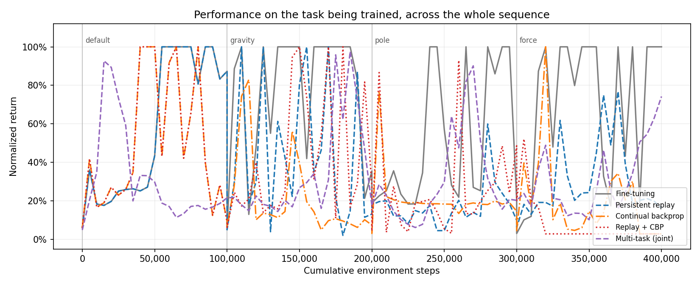
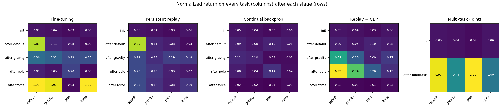
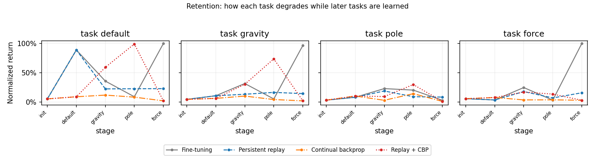
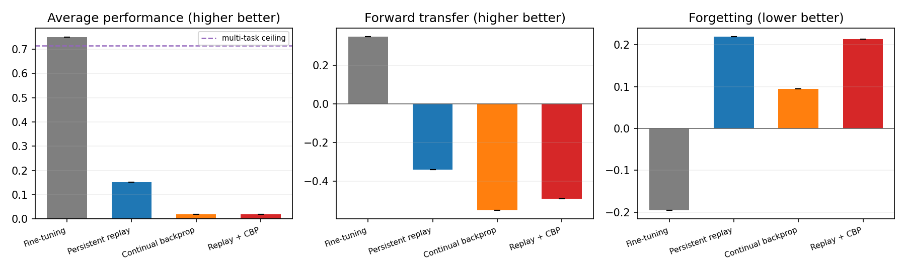
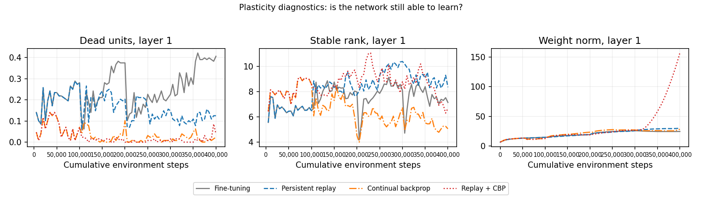

# Continual RL on CartPole: stability vs plasticity

1 seed(s); 100,000 environment steps per task; order default -> gravity -> pole -> force.
Cells are mean [95% bootstrap CI] over seeds.

## Headline metrics

| Agent | AP ↑ | FT ↑ | Forgetting ↓ | Zero-shot ↑ |
|---|---:|---:|---:|---:|
| Fine-tuning | 0.749 | 0.346 | -0.196 | 0.122 |
| Persistent replay | 0.153 | -0.339 | 0.219 | 0.121 |
| Continual backprop | 0.019 | -0.550 | 0.094 | 0.041 |
| Replay + CBP | 0.019 | -0.491 | 0.214 | 0.096 |
| Multi-task (joint) | 0.713 | — | — | — |

**AP** is the mean normalized return over all tasks once the whole sequence is finished.
**FT** compares the area under each task's learning curve with a fresh agent trained on that task alone,
as `(AUC - AUC_scratch) / (1 - AUC_scratch)`, averaged over tasks 2..N. Task 1 is excluded because no
prior knowledge exists there, so its value is structurally zero.
**Forgetting** is the drop from a task's score right after learning it to its score at the end, averaged
over tasks 1..N-1; the last task is excluded because its two measurements are the same number.
**Zero-shot** is the normalized return on a task the instant before training on it begins.

### Both averaging conventions

| Agent | F (mean over all N) | F (excluding last) | FT (mean over all N) | FT (excluding first) |
|---|---:|---:|---:|---:|
| Fine-tuning | -0.147 | -0.196 | 0.260 | 0.346 |
| Persistent replay | 0.164 | 0.219 | -0.254 | -0.339 |
| Continual backprop | 0.071 | 0.094 | -0.469 | -0.550 |
| Replay + CBP | 0.160 | 0.214 | -0.424 | -0.491 |
| Multi-task (joint) | — | — | — | — |

## Per-task detail

### Forgetting by task

| Agent | default | gravity | pole | force |
|---|---|---|---|---|
| Fine-tuning | -0.110 | -0.652 | 0.174 | 0.000 |
| Persistent replay | 0.662 | -0.011 | 0.007 | 0.000 |
| Continual backprop | 0.070 | 0.081 | 0.132 | 0.000 |
| Replay + CBP | 0.070 | 0.283 | 0.288 | 0.000 |
| Multi-task (joint) | — | — | — | — |

### Forward transfer by task

| Agent | default | gravity | pole | force |
|---|---|---|---|---|
| Fine-tuning | 0.000 | 0.549 | 0.247 | 0.242 |
| Persistent replay | 0.000 | -0.040 | -0.263 | -0.713 |
| Continual backprop | -0.223 | -0.461 | -0.211 | -0.980 |
| Replay + CBP | -0.223 | -0.062 | -0.138 | -1.274 |
| Multi-task (joint) | — | — | — | — |

### Raw AUC difference vs scratch by task

| Agent | default | gravity | pole | force |
|---|---|---|---|---|
| Fine-tuning | 0.000 | 0.295 | 0.162 | 0.099 |
| Persistent replay | 0.000 | -0.022 | -0.173 | -0.290 |
| Continual backprop | -0.093 | -0.248 | -0.138 | -0.399 |
| Replay + CBP | -0.093 | -0.033 | -0.091 | -0.518 |
| Multi-task (joint) | — | — | — | — |

### Zero-shot by task

| Agent | default | gravity | pole | force |
|---|---|---|---|---|
| Fine-tuning | 0.052 | 0.106 | 0.228 | 0.030 |
| Persistent replay | 0.052 | 0.106 | 0.188 | 0.069 |
| Continual backprop | 0.052 | 0.061 | 0.028 | 0.036 |
| Replay + CBP | 0.052 | 0.061 | 0.092 | 0.134 |
| Multi-task (joint) | — | — | — | — |

## Scratch baseline

| Task | default | gravity | pole | force |
|---|---|---|---|---|
| AUC | 0.582 | 0.462 | 0.344 | 0.593 |
| 1 - AUC (FT denominator) | 0.418 | 0.538 | 0.656 | 0.407 |

A small denominator amplifies noise in that task's FT, and it differs per task, so the per-task FT
table above should be read alongside the raw AUC differences.

## Figures

