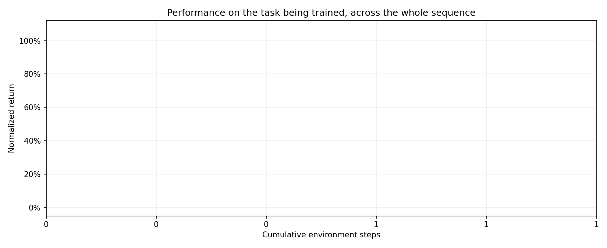
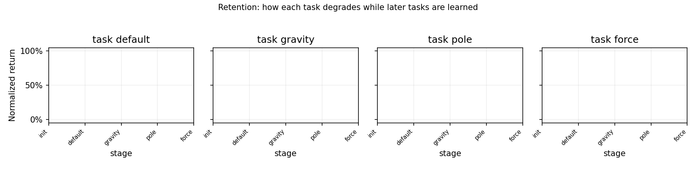
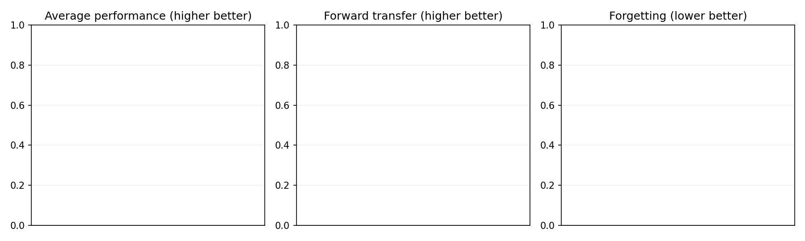
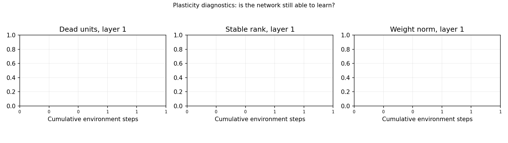

# Continual RL on CartPole: stability vs plasticity

1 seed(s); 100,000 environment steps per task; order default -> gravity -> pole -> force.
Cells are mean [95% bootstrap CI] over seeds.

## Headline metrics

| Agent | AP ↑ | FT ↑ | Forgetting ↓ | Zero-shot ↑ |
|---|---:|---:|---:|---:|

**AP** is the mean normalized return over all tasks once the whole sequence is finished.
**FT** compares the area under each task's learning curve with a fresh agent trained on that task alone,
as `(AUC - AUC_scratch) / (1 - AUC_scratch)`, averaged over tasks 2..N. Task 1 is excluded because no
prior knowledge exists there, so its value is structurally zero.
**Forgetting** is the drop from a task's score right after learning it to its score at the end, averaged
over tasks 1..N-1; the last task is excluded because its two measurements are the same number.
**Zero-shot** is the normalized return on a task the instant before training on it begins.

### Both averaging conventions

| Agent | F (mean over all N) | F (excluding last) | FT (mean over all N) | FT (excluding first) |
|---|---:|---:|---:|---:|

## Per-task detail

### Forgetting by task

| Agent | default | gravity | pole | force |
|---|---|---|---|---|

### Forward transfer by task

| Agent | default | gravity | pole | force |
|---|---|---|---|---|

### Raw AUC difference vs scratch by task

| Agent | default | gravity | pole | force |
|---|---|---|---|---|

### Zero-shot by task

| Agent | default | gravity | pole | force |
|---|---|---|---|---|

## Scratch baseline

| Task | default | gravity | pole | force |
|---|---|---|---|---|
| AUC | 0.582 | 0.462 | 0.344 | 0.593 |
| 1 - AUC (FT denominator) | 0.418 | 0.538 | 0.656 | 0.407 |

A small denominator amplifies noise in that task's FT, and it differs per task, so the per-task FT
table above should be read alongside the raw AUC differences.

## Figures

